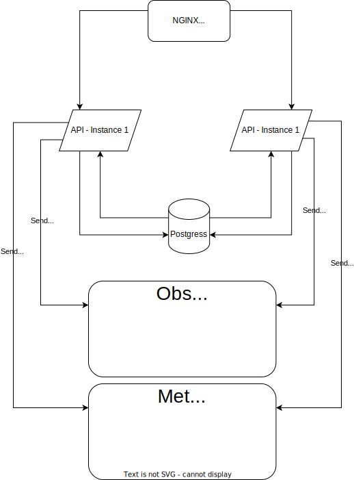

# Sample CRUD Backend in ASP.NET Core

This code represents a basic CRUD (Create, Read, Update, Delete) backend implementation in ASP.NET Core.

It allows for the creation, retrieval, updating, and deletion of data from a database using HTTP requests.

The code is organized into separate controllers for each entity, with corresponding methods for each CRUD operation.

The controllers use Entity Framework Core to interact with the database, and the code is designed to be easily extendable
to support additional entities and operations as needed.

<!--  -->

<p align="center" width="100%">
    
</p>

# Running this project
```bash
foo@bar:~$ cd infra/
foo@bar:~$ ./run.sh
```

If you use Linux or Mac you will need to release the execution privileges of the .sh file
```bash
foo@bar:~$ chmod +x run.sh
```

Grafana will be available at http://localhost:3000 (user: admin, password: admin)

Kibana will be available at http://localhost:5601

Elasticsearch will be available at http://localhost:9200

Prometheus will be available at http://localhost:9090

API will be available at http://localhost:5000

Postgres will be available at http://localhost:5432

# Debugging API
Running the project in debug mode is as simple as running the following command: **F5.** *(In Visual Studio Code)*

All Tasks and Lanch will be executed automatically.

<!-- # API Documentation -->


