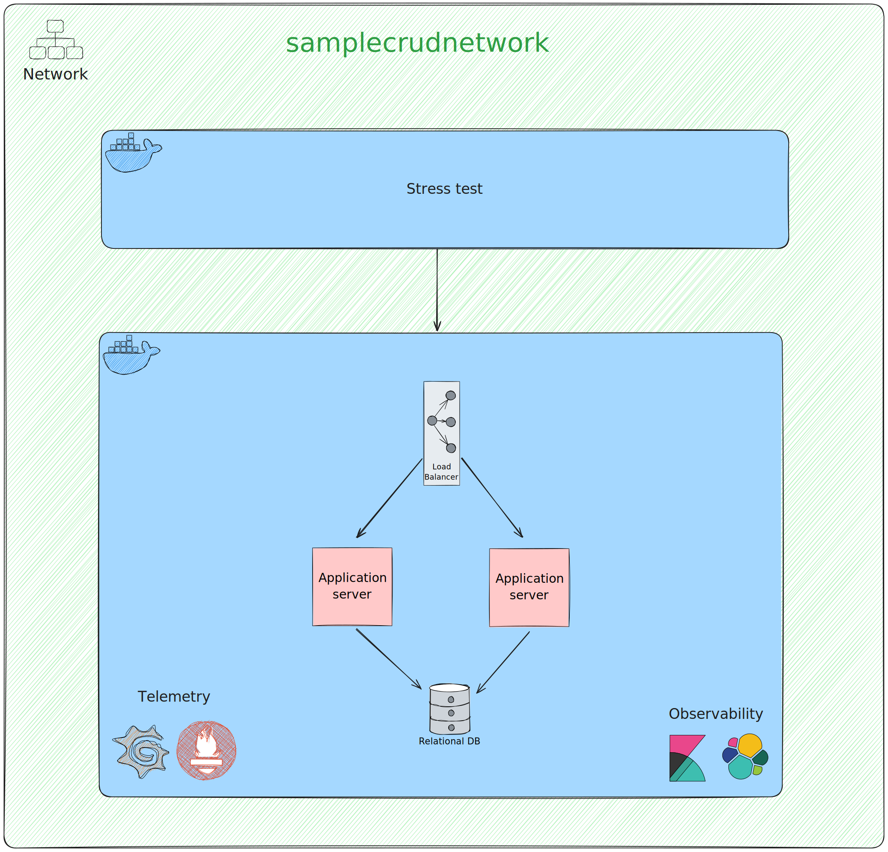
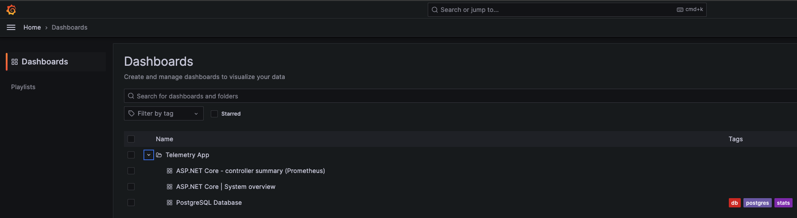

# Sample CRUD Backend in ASP.NET Core

This repository represent a simple CRUD implementation using ASP.NET core, running in a distributed infrastructure, with: two instances of application, one DB more load balancer only using **1.5 CPU and 3GB RAM** total

Implementation a basic CRUD (Create, Read, Update, Delete) using ASP.NET Core.

It allows for the creation, retrieval, updating, and deletion of data from a database using HTTP requests.

The controllers use Entity Framework Core to interact with the database, and the code is designed to be easily extendable
to support additional entities and operations as needed.

The project also includes a suite of unit tests and integration tests to verify the controller logic and stress tests to verify the infrastructure.

## Technologies used
- **ASP.NET Core 7.0** (Web Framework)
- **.NET Core 7.0** (Runtime and SDK)
- **Entity Framework Core 7.0** (Object Relational Mapper)
- **Serilog** (Logging Library)
- **PostgreSQL** (Database)
- **Postgres Exporter** (Monitoring)
- **Docker** (Containerization)
- **Docker Compose** (Container Orchestration)
- **Nginx** (Load Balancer)
- **Prometheus** (Monitoring)
- **Grafana** (Monitoring)
- **Kibana** (Observability)
- **Elasticsearch** (Observability)


## Architecture Overview

<p align="center" width="100%">
    
</p>


# Running this project
```bash
foo@bar:~$ cd infra/

foo@bar:~$ ./run.sh
```

If you use Linux or Mac you will need to release the execution privileges of the .sh file
```bash
foo@bar:~$ chmod +x run.sh
```

Grafana will be available at http://localhost:3000 (user: admin, password: admin)

Kibana will be available at http://localhost:5601

Elasticsearch will be available at http://localhost:9200

Prometheus will be available at http://localhost:9090

API will be available at:
- Instance One: http://localhost:5261
- Instance Two: http://localhost:5262

Load Balancer (nginx) will be available at http://localhost:9999

Postgres will be available at http://localhost:5432

# Running Stress Tests
```bash 
foo@bar:~$ cd ./tests/stress-tests/

foo@bar:~$ ./run.sh
```

# Collecting Metrics
> **Note:** You need to have the project running to collect the metrics.

Acesses Grafana will be available at http://localhost:3000 (user: admin, password: admin)

In the left menu, click in **Dashboards** and then **Telemetry App**.

<p align="center" width="100%">
    
</p>


# Collecting Logs
> **Note:** You need to have the project running to collect the logs.

Acesses Kibana will be available at http://localhost:5601

In the left menu, click in **Discover**. 

# Debugging API
Running the project in debug mode is as simple as running the following command: **F5.** *(In Visual Studio Code)*

All Tasks and Lanch will be executed automatically.

